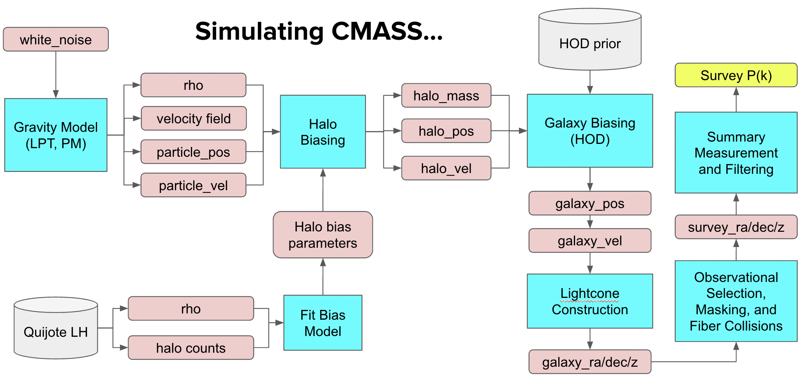

# ltu-cmass
A repository for storing code for the LtU Express Go Big pipeline. The scripts in this repository are designed to simulate and analyze mocks of the CMASS NGC galaxy sample from the BOSS survey.

## Pipeline


The minimal example of the pipeline using a `pmwd` simulation can be run using the following commands:
```bash
# Run nbody density fields
python -m cmass.nbody.pmwd

# Populate density fields with halos
python -m cmass.bias.rho_to_halo

# Remap the cube into a cuboid to match the survey volume
python -m cmass.survey.remap_cuboid

# Apply the survey mask to the cuboid
python -m cmass.bias.apply_hod

# Apply the NGC survey mask
python -m cmass.survey.ngc_selection

# Measure the power spectrum of the galaxy catalog
python -m cmass.summaries.Pk_nbkit
```

## Getting Started
See installation and usage instructions in [INSTALL.md](INSTALL.md).


## Organization

Below, we list the functionality of each script in the repository as well as its major dependencies:

### cmass.nbody
  - `borg2lpt` - Simulate a cubic volume using Borg2LPT. Requires: `borg`.
  - `pmwd` - Simulate a cubic volume using PM-WD. Requires: [`pmwd`](https://github.com/eelregit/pmwd/tree/master).
  - `jax2lpt` - Simulate a cubic volume using Jax2LPT. Requires: `borg` and `jax_lpt`. [DEPRECATED]

### cmass/survey
- `remap_as_cuboid` - Remap a periodic volume to a cuboid. Requires: [`cuboid_remap_jax`](https://github.com/maho3/cuboid_remap_jax).
- `ngc_selection` - Applies CMASS NGC survey mask to a lightcone-shaped volume of galaxies. Requires: `nbodykit`, `pymangle`, and `astropy`.

### cmass/bias
- `fit_halo_bias` - Fit a halo biasing model to map density fields to halo counts. Requires: `astropy` and `scipy`.
- `rho_to_halo` - Sample halos from the density field using a pre-fit bias model. Requires: `scipy`.
- `apply_hod` - Sample an HOD realization from the halo catalog using the Zheng+(2007) model. Requires: `nbodykit`.

### cmass/summaries
- `calc_Pk_nbkit` - Measure the power spectrum of a galaxy catalog. Requires: `nbodykit`.

### Notebooks
- `preprocess.ipynb` -  Executes various preprocessing tasks prepare for mass simulation. Designed to be run once at the start of code development.
- `validation.ipynb` - Validates outputs at intermediate stages in the forward pipeline.
