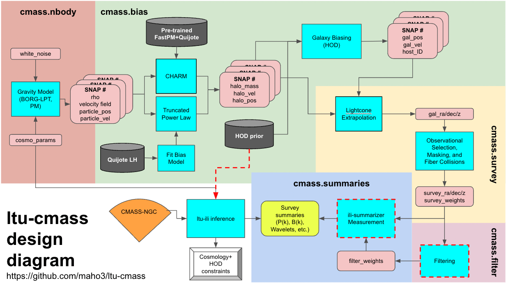

# ltu-cmass
A repository for storing code for the LtU Express Go Big pipeline. The scripts in this repository are designed to simulate and analyze mocks of the CMASS NGC galaxy sample from the BOSS survey.

## Pipeline


The minimal example of the pipeline using a `pmwd` simulation in a 3 Gpc/h volume can be run using the following commands:
```bash
# Run nbody density fields
python -m cmass.nbody.pmwd nbody=3gpch

# Populate density fields with halos
python -m cmass.bias.rho_to_halo nbody=3gpch

# Populate the halos with galaxies
python -m cmass.bias.apply_hod nbody=3gpch

# Construct the lightcone and apply the NGC survey mask
python -m cmass.survey.ngc_selection nbody=3gpch

# Measure the power spectrum of the galaxy catalog
python -m cmass.summaries.Pk nbody=3gpch
```

## Getting Started
See basic installation and usage instructions in [INSTALL.md](INSTALL.md). For further information, see the [docs](./docs).


## Organization

Below, we list the functionality of each script in the repository as well as its major dependencies:

### cmass/conf
- This folder contains [`hydra`](https://hydra.cc/docs/tutorials/basic/your_first_app/simple_cli/) configuration files for the pipeline. 
- `config.yaml` - Construction of default configurations
- `global.yaml` - Global parameters (working directory, logging, etc.)
- `nbody` - Various gravity solver configs (resolution, timesteps, box size, etc.)
- `bias` - Biasing model configs (halo bias, HOD, etc.)
- `fit` - Fitting configs for bias models (fitting parameters, etc.)
- `survey` - Survey mask configs (geometry, fiber collisions, etc.)


### cmass.nbody
- `borglpt` - Simulate a cubic volume using BORG 1/2LPT. 
- `borgpm` - Simulate a cubic volume using BORG PM. 
- `pmwd` - Simulate a cubic volume using [`pmwd`](https://github.com/eelregit/pmwd/tree/master).

### cmass.bias
- `fit_halo_bias` - Fit a halo biasing model to map density fields to halo counts. 
- `rho_to_halo` - Sample halos from the density field using a pre-fit bias model. 
- `apply_hod` - Sample an HOD realization from the halo catalog using the Zheng+(2007) model. 

### cmass.survey
- `ngc_selection` - Applies CMASS NGC survey mask to a lightcone-shaped volume of galaxies. 
- `ngc_lightcone` - Stitches multiple snapshots together to create an extrapolated lightcone, following the method of [nuvoid_production](https://github.com/leanderthiele/nuvoid_production). Then applies the CMASS NGC survey mask.

### cmass.summaries
- `Pk` - Measure the power spectrum of a galaxy catalog. Requires: `pypower`.

### Notebooks
- `preprocess.ipynb` -  Executes various preprocessing tasks prepare for mass simulation. Designed to be run once at the start of code development. [Deprecated]
- `validation.ipynb` - Validates outputs at intermediate stages in the forward pipeline. [Deprecated]
